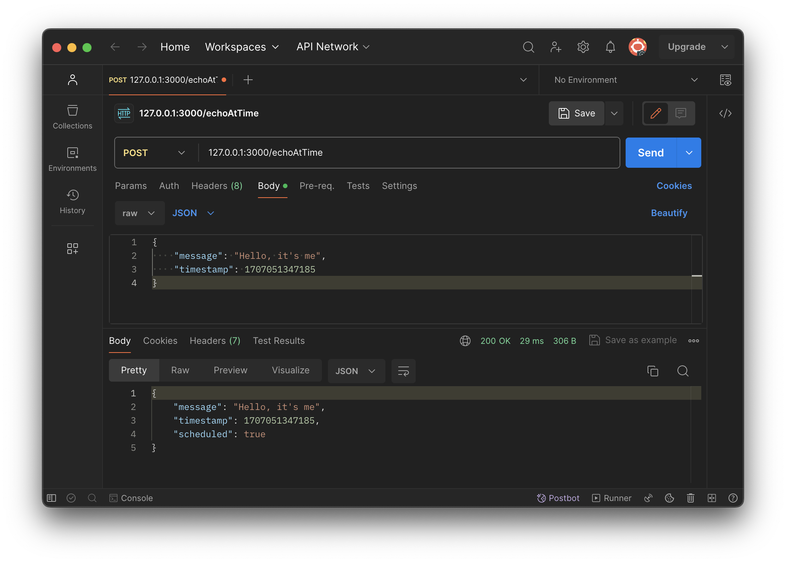

# Scheduler


## Requirements

Your task is to write a simple application server that prints a message at a given time in the future.

The server has only 1 API:

echoAtTime - which receives two parameters, time and message, and writes that message to the server console at the given time.

Since we want the server to be able to withstand restarts, it will use Redis to persist the messages and the time they should be sent at.

You should also assume that there might be more than one server running behind a load balancer (load balancing implementation itself does not need to be provided as part of the answer).

In case all servers were down when a message should have been printed, it should print it out when they go back online.

The focus of the exercise is the efficient use of Redis and its data types as well as seeing your code in action. The application should preferably be written in Node.js.

The focus of the exercise is:

-   the efficient use of Redis and its data types

-   should be able to handle huge amount of messages

-   the same message should not be printed more than once

-   should be scalable

-   seeing your code in action (SOLID would be a plus)

-   use only `ioredis` client

## Description

The implemented solution is based on [Redis Streams](https://redis.io/docs/data-types/streams/).

## How to install?

Clone repository:

```
git clone <repository url>
```

Then go into the created directory.

To install the required version of Node.js the [nvm](https://github.com/nvm-sh/nvm) can be used:

```
nvm install
```

To install `node_modules`:

```
npm install
```

## How to start?

To start the Redis server run the following command:

```
docker compose -f docker-compose-redis.yml up
```

To start the server run the following command:

```
npm start
```

To start the server in the detailed logs mode:

```
npm run start:dev
```

The server will start on [http://127.0.0.1:3000](http://127.0.0.1:3000).

## How to send request?

The service provides only one endpoint: `/echoAtTime`.

Postman can be used to perform a request:



Request URL:

```
127.0.0.1:3000/echoAtTime
```

Request body:

```
{
    "message": "Hello, it's me",
    "timestamp": 1707051347185
}
```
